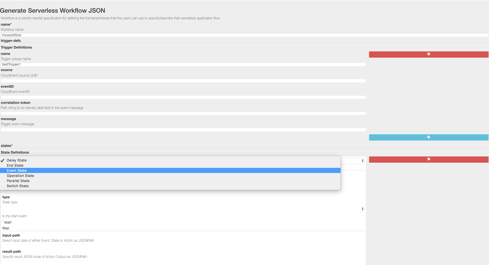

## Workflow React Form Editor

This project provides simple form editor for Serverless Workflow.
**Note** it is still workf in progress (contributions welcome!)

## Getting started

1. Clone this repository
2. Go into the workflow-react-form directory
3. Run 'npm start'
4. Open [http://localhost:3000](http://localhost:3000) to view it in the browser.

## How to get the JSON?

After editing the form click on the "Submit" button.
This will trigger your workflow JSON to be downloaded by the browser.
You will see the download of "workflow.json" file which contains the generated serverless workflow json.

## What it looks like

