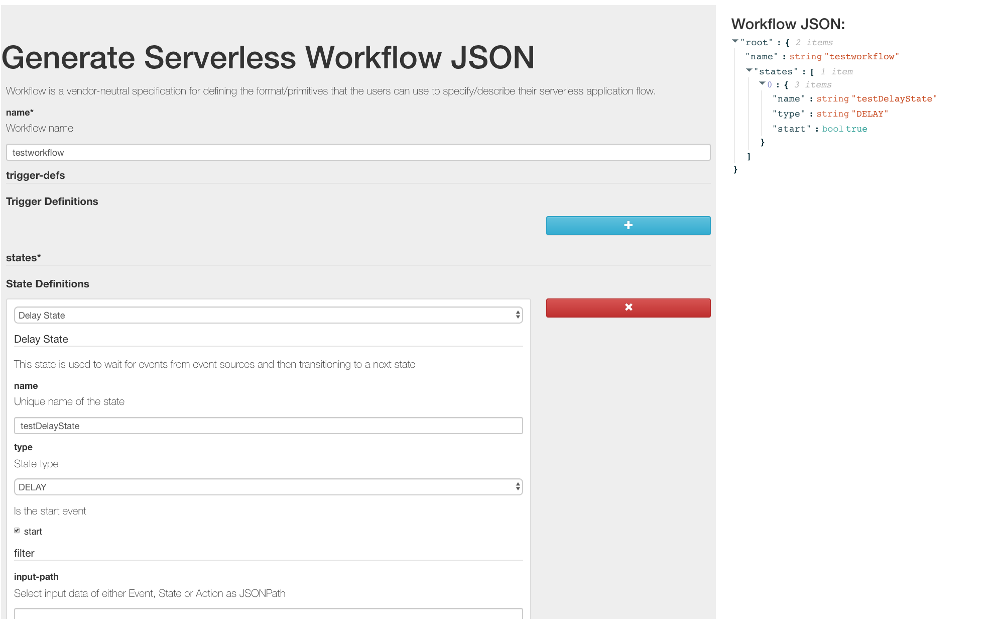

## Workflow React Form Editor

This project provides simple form editor for Serverless Workflow.

**Note** it is still workf in progress (contributions welcome!)

## Getting started

1. Clone this repository
2. Go into the workflow-react-form directory
3. Run 'npm start'
4. Open [http://localhost:3000](http://localhost:3000) to view it in the browser.

## How to get the JSON?

On the right side of the page you have a live-update JSON view. You can copy it (via copy buttonns) at any time.
Alternatively at the bottom of the form you can click the Submit button to download the workflow json.

## What it looks like

